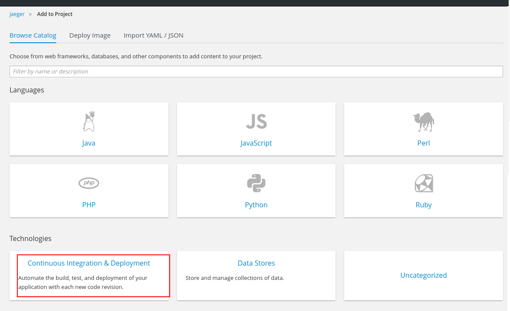
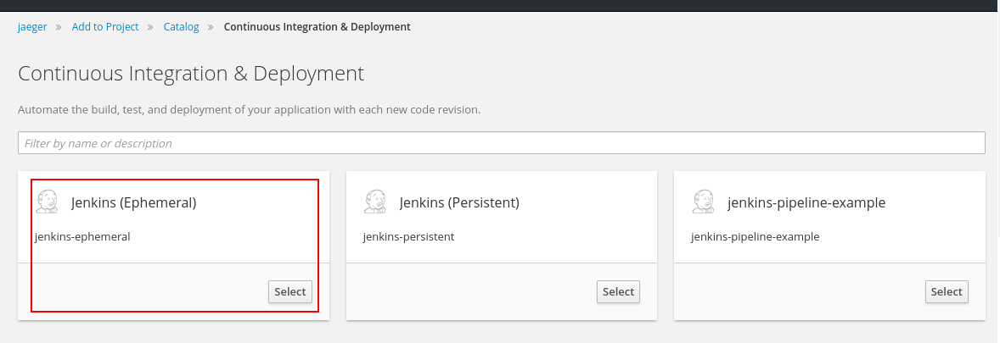
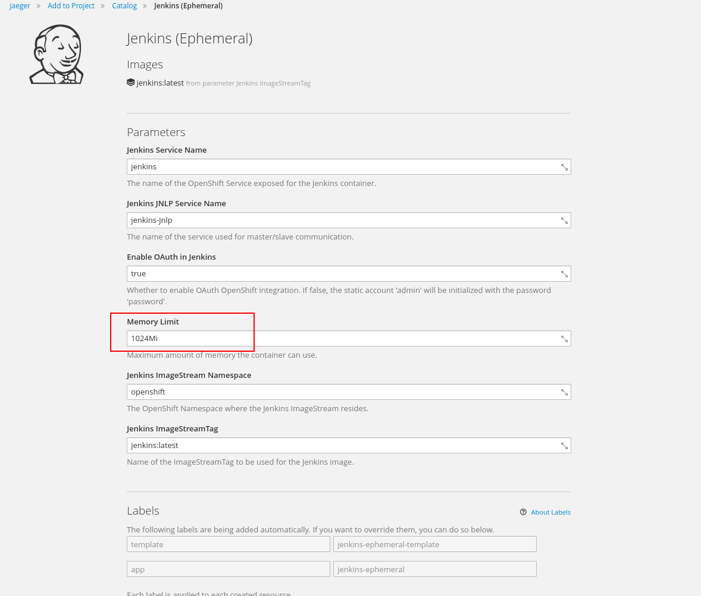
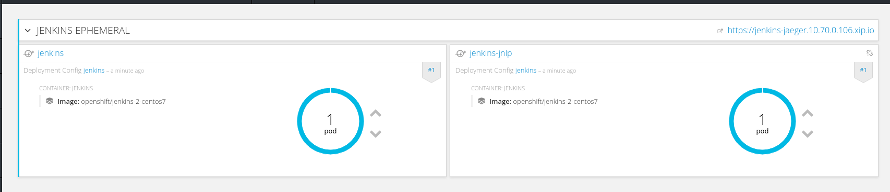
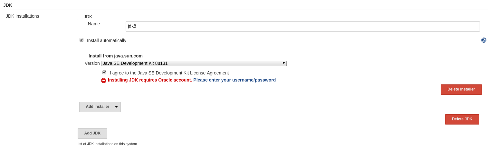
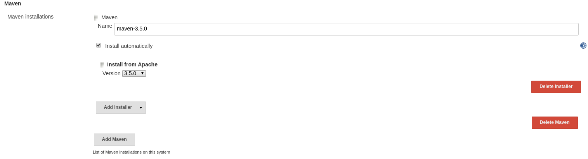
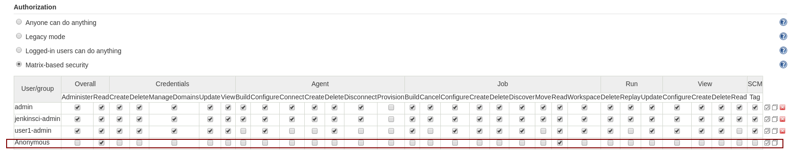
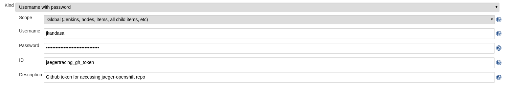
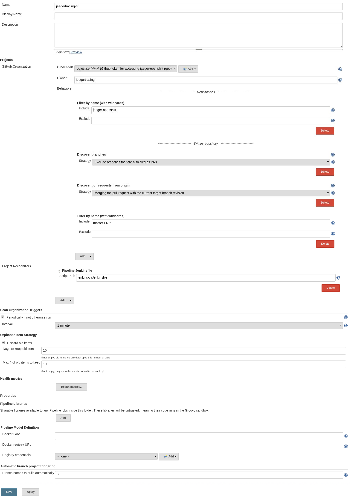

# Jenkins CI
Jenkins CI deploys OpenShift templates and verifies. This CI also runs functional tests from [jaeger-java-test](https://github.com/Hawkular-QE/jaeger-java-test) repository.

## How to setup Jenkins CI

### Prerequirements
* Setup [openshift](https://github.com/openshift/origin) with the user `jenkinsci`

#### Setup environment for Jenkins
Jenkins needs set of permissions to deploy/un-deploy Jaeger on Openshift. The following commands satisfy those requirements.

Login as a `root` user on the OpenShift cluster machine and execute the following commands.

```bash
oc login -u jenkinsci
oc new-project jaeger-ci
```

#### Setup Jenkins instance on OpenShift
We have two flavors of Jenkins for Openshift. 1. `jenkins-persistent`, 2. `jenkins-ephemeral`. In this document, We choose the second option. To know more about Jenkins on Openshift read [this page](https://github.com/openshift/origin/tree/master/examples/jenkins)

We tried Jenkins with default `512Mi`. Works too slow. Hence we would recommend `Memory Limit` to `1024Mi` or above.

##### Installation steps
* Open OpenShift console [Example: https://localhost:8443]
* Login as `jenkinsci` user
* Select `jaeger-ci` namespace(project).
* Click on `Add to project` and follow the screens below.










**Important:** Jenkins server needs permission to access `daemonset` for the project `jaeger-ci`. Login as a `root` user on the OpenShift cluster machine and execute the following commands.
```bash
oc login -u system:admin
oc adm policy add-role-to-user daemonset-admin system:serviceaccount:jaeger-ci:jenkins -n jaeger-ci
```

##### Setup tools [`maven-3.5.0` and `jdk8`]
* Launch Jenkins server: https://jenkins-jaeger-ci.<ip>.xip.io/ Login as `jenkinsci` user
* Go to `Manage Jenkins` >> `Global Tool Configuration`(https://jenkins-jaeger-ci.<ip>.xip.io/configureTools/)
* Add `maven` and `jdk` tool. Which is used in [Jenkins pipeline file](/JenkinsfileOpenShift)
* JDK 8 should be used with the name of `jdk8`
* Maven 3.5.0 should be used in the name of `maven-3.5.0`






#### Enable Anonymous read permission on Jenkins server
We have a [script](push-logs.sh) to publish console log to the world from internal Jenkins server. For this [script](push-logs.sh), we need global anonymous read permission.

* Login to Jenkins server [Example: https://jenkins-jaeger-ci.<ip>.xip.io/] with the Openshift user `jenkinsci`
* Go to `Manage Jenkins` >> `Configure Global Security` (https://jenkins-jaeger-ci.<ip>.xip.io/configureSecurity/)
* Under the section `Access Control`, enable `overall` and `Job` read permission for `Anonymous` user
* To save this configuration click on `Save` button.




#### Setup GitHub access token on Jenkins server credentials
To publish PR status and console log back to GitHub, Jenkins needs GitHub authentication token with required permission. To create GitHub access token follow [this document](https://help.github.com/articles/creating-a-personal-access-token-for-the-command-line/)

* Login to Jenkins server [Example: https://jenkins-jaeger-ci.<ip>.xip.io/] with the Openshift user `jenkinsci`
* Go to `Credentials` >> `System` >> `Global credentials (unrestricted)` >> `Add Credentials`
* Select `Kind` as `Username with password`
* Enter GitHub username on `Username` field
* Enter GitHub access token on `Password` field
* Enter `jaegertracing_gh_token` on `ID` field. (**Important:** `jaegertracing_gh_token` id refered on [Jenkinsfile](Jenkinsfile). Do not use different ID or do not leave this field as blank)
* Enter description
* To save this configuration click on `OK` button.



##### Create Jenkins job with existing pipeline scripts
Jenkins pipeline script is located [here](/jenkins-ci/Jenkinsfile)

* Login to Jenkins server [Example: https://jenkins-jaeger-ci.<ip>.xip.io/] with the Openshift user `jenkinsci`
* Click on `New Item`
* Enter `Enter an item name` (example: jaegertracing-ci)
* Select project type as `GitHub Organization` and click `OK`
* Under the section `Projects` >> `GitHub Organization`
	* Set `Owner` as `jaegertracing`
	* Set `Repository name pattern` as `jaeger-openshift`
	* Set `Include branches` as `master PR-*`
	* Set `Project Recognizers` >> `Script Path` as `jenkins-ci/Jenkinsfile`
* Set `Scan Organization Triggers` >> `Periodically if not otherwise run` >> `Interval` as `1 minute`
* Save the project



All set ready :)